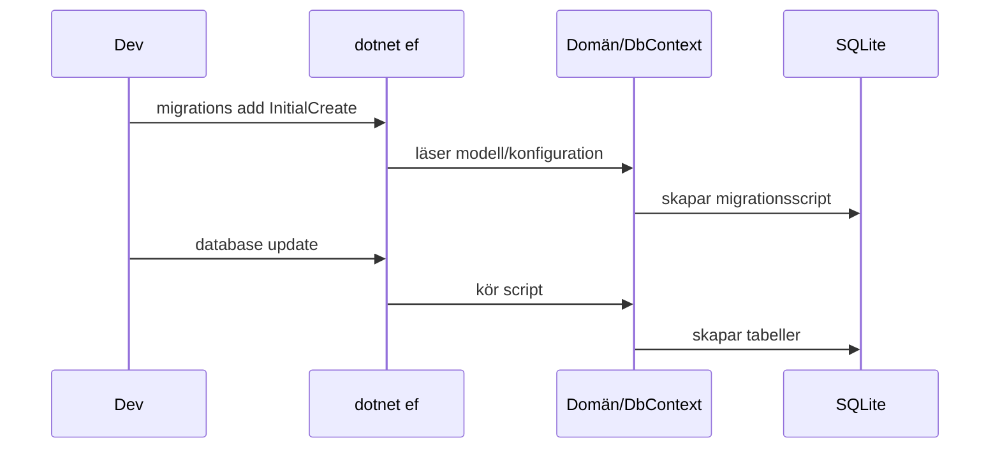

# Migrationer – skapa & uppdatera databas

## Mål
Skapa första migrationen och materialisera SQLite‑databas. 

## Steg 

1. Lägg till `QuizBattleContextFactory` i `QuizBattle.Infrastructure.Data`

```csharp
using Microsoft.EntityFrameworkCore;
using Microsoft.EntityFrameworkCore.Design;

public QuizBattleDbContext CreateDbContext(string[] args)
{
    var optionsBuilder = new DbContextOptionsBuilder<QuizBattleDbContext>();
    optionsBuilder.UseSqlite("Data Source=QuizBattle.db");

    return new QuizBattleDbContext(optionsBuilder.Options);
}
```

2. Skapa Api-projekt 

```bash
dotnet new web -n QuizBattle.Api -o src/QuizBattle.Api
dotnet sln add src/QuizBattle.Api
dotnet add src/QuizBattle.Api reference src/QuizBattle.Infrastructure
```

3. Anropa AddInfrastructureRepositories i `Program.cs`

```csharp
using QuizBattle.Infrastructure.Extensions;

var builder = WebApplication.CreateBuilder(args);
builder.Services.AddInfrastructureRepositories(); // Lägg till den här raden

var app = builder.Build();

app.MapGet("/", () => "Hello World!");

app.Run();
```

4. Kör migration

```bash
dotnet ef migrations add InitialCreate --project <InfrastructureProj> --startup-project <ApiProj>
dotnet ef database update --project <InfrastructureProj> --startup-project <ApiProj>
````

> Byt `<InfrastructureProj>` och `<ApiProj>` till era kataloger/proj‑filer (`src/QuizBattle.Infrastructure` och `src/QuizBattle.Api`).

## Förväntat resultat

*   Mappen Migrations genereras under QuizBattle.Infrastructure
*   `quizbattle.db` skapas i host‑projektets utdata

## Vanliga fel

*   “No design‑time services” → installera `Microsoft.EntityFrameworkCore.Design`
*   “No parameterless constructor” → lägg till paramlös ctor i entiteter
*   “Unable to create an object of type …” → säkerställ `AddDbContext` och korrekt startup‑projekt

## Flöde



## Checklista

*   [ ] Migration skapad
*   [ ] Databas uppdaterad
*   [ ] Tabellerna finns (Questions/Choices/Answers)
