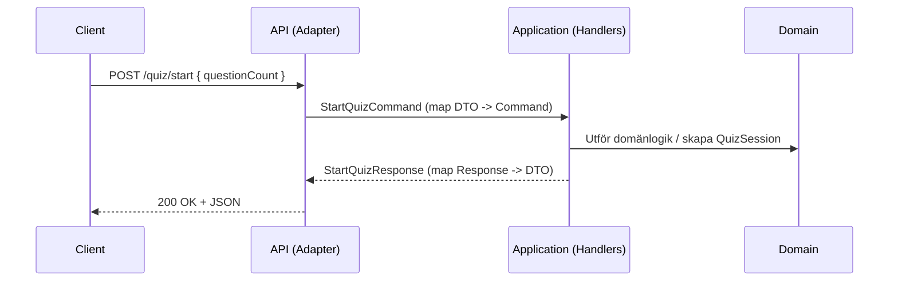


# 🌐 API‑lagret

**Syfte:** Adapter/transportlager. Översätter HTTP till Application‑commands och Application‑responses till HTTP‑responses. Innehåller ingen affärslogik.

## Översikt

- Minimal API eller Controllers.
- DTO:er för request/response.
- DI‑registrering av Application‑handlers, services och Infrastructure‑implementationer.



## Ansvar

- Routing, statuskoder, `ProblemDetails`.
- Modellbindning och validering på transportnivå.
- DI‑setup (registrera portar + handlers + services).

## Principer

- **Ingen affärslogik** här.
- Tydlig mappning mellan DTO ↔ Command/Response.
- Fel översätts till lämpliga HTTP‑svar (t.ex. 400, 404, 409).

## Exempel (schematiskt)

```csharp
// Schematisk exempel på minimal API endpoint
app.MapPost("/quiz/start", async (StartQuizRequest dto, StartQuizHandler handler, HttpContext context, CancellationToken ct) =>
{
    // Map DTO -> Command
    var command = new StartQuizCommand(dto.QuestionCount, dto.Category, dto.Difficulty);

    // Anropa handler (application logic)
    var res = await handler.HandleAsync(command, context.RequestAborted);

    // Map Response -> DTO och returnera
    return Results.Ok(new StartQuizResponseDto(res.SessionId, res.Questions));
});
```

## Anti‑pattern (ska vi alltid undvika)

- Lägga domänregler i controllers.
- Anropa repositories direkt från API utan Application.

## Testning (överkurs)

- Integrations‑tester med in‑memory repos.
- Contract‑tester av DTO‑mappning.

---
