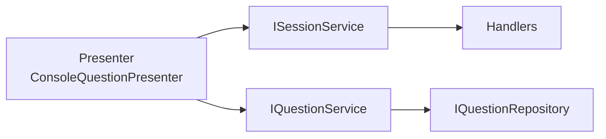

# 🖥️ Console‑klienten

**Syfte:** En klient som presenterar frågor och läser användarens input. Håller all **UI‑logik** lokalt i Console‑projektet. Ingen affärslogik här.

## Översikt

- **Presenter** (t.ex. `ConsoleQuestionPresenter`) visar frågor och läser svar.
- Anropar **Application.Services** (`ISessionService`, `IQuestionService`) för use cases.
- Extensions för visning, t.ex. `GetChoiceCount()`.



## Ansvar

- Visa frågor, läsa input (`System.Console`).
- Mappa användarval till `AnswerQuestionCommand` via `ISessionService`.

## Principer

- **UI‑kod endast här** (Display/Prompt).
- Ingen domänregel i Console.

## Exempel (förenklad loop)

```csharp
// Enkel loop som visar hur presenter + sessionService kan användas
var presenter = new ConsoleQuestionPresenter();
var start = await sessionService.StartAsync(3);
int asked = 0, score = 0;
foreach (var q in start.Questions)
{
    asked++;
    presenter.DisplayQuestion(q, asked); // Visa fråga

    // Läs användarens val (1..n)
    var pick = presenter.PromptForAnswer(q);

    // Hämta koden för valt svar
    var code = q.GetChoiceAt(pick - 1).Code;

    // Anropa application för att registrera svaret
    var res = await sessionService.AnswerAsync(start.SessionId, q.Code, code);
    if (res.IsCorrect) score++;
}

// Avsluta sessionen och visa poäng
var fin = await sessionService.FinishAsync(start.SessionId);
Console.WriteLine($"Poäng: {fin.Score}/{fin.AnsweredCount}");
```

## Anti‑pattern (ska vi alltid undvika)

- Anropa repositories eller domänen direkt från Console.
- Lägga affärsregler i UI‑loop.

## Testning

- Begränsat: testa presenter‑logik med fakes (validera input loop).
- Fulla flöden via Application‑handlers i integrationstester.

---
