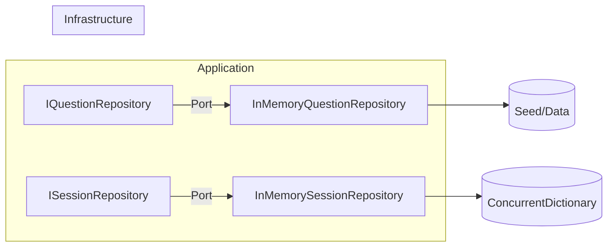


# 🧩 Infrastructure‑lagret

**Syfte:** Implementera **ports** från Application‑lagret (adapters) – t.ex. repositories. Utbytbart mot andra tekniker (EF Core, Redis, etc.).

## Översikt

- `Repositories/` – in‑memory implementationer av `IQuestionRepository`, `ISessionRepository`.
- DI‑registrering sker i API/Console.

## Ansvar

- Ge **konkreta implementationer** av portar.
- Ingen affärslogik, endast tekniskt genomförande.

## Principer

- **Bytbarhet**: låt implementationer vara lätta att ersätta.
- **Stabilt kontrakt**: följ Application‑interfaces exakt.

## Anti‑patterns (ska vi alltid undvika)

- Lägga affärsregler i repositories.
- Låta Infrastructure referera UI‑lager.

## Testning (överkurs)

- Enkla tester mot in‑memory implementationer.
- Byt ut mot mock/fakes i Application‑tester.

---
